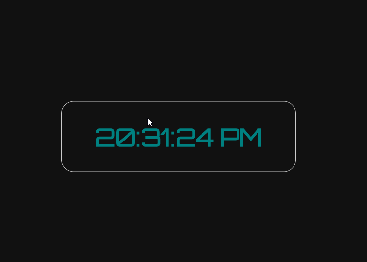

# Current-Time-GUI
Shows real-life time: Implemented with basic GUI
Resources: HTML, CSS, JavaScript, Visual Studio Code

📝 `NOTE:` Below is the App Walkthrough
### App Walk-through

- [x] Shows current time
- [x] Build in logic to show time in user's timezone
- [x] Push code to GitHub
